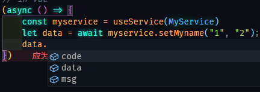

# 在项目中使用 `d4axios`

> `d4axios` **(Decorators for Axios)** 是一款基于`axios`请求方式的装饰器方法组，可以快速地对服务进行管理和控制，增强前端下服务请求方式，有效降低服务的认知难度，并且在基于ts的情况下可以保证服务的前后台的数据接口一致性

## 一、 引入配置信息
在这里提供了几种配置方式，可以采用原始的axios的配置方法，也可以采用 `d4axios` 提供的方法

```ts
// 在 vue3下我们建议使用 `createService` 
// 其他情况下使用 `serviceConfig`
import { createApp } from 'vue'
import {createService,serviceConfig} from 'd4axios'


createApp(App).use(createService({ ... /* 一些配置信息 */}))

```
### 1.1 提供的axios配置项

`createService` 和 `serviceConfig` 使用的配置项是一样的，并且完全兼容axios的配置。在现有的项目中改造的话，可以使用：

```ts
// 可以直接使用由d4axios提供的服务
createService()

// 可直接传入axios的相关配置，由d4axios自动基于配置相关构建
createService({axios:{ baseURL:"domain.origin" }})

// 可直接传入已经配置好的 `axios` 实例对象
const axios = Axios.create({ /* 你的配置*/ });


createService({axios})
```
### 1.2 提供基于请求和相应数据的配置

```ts
createService({
    beforeRequest(requestData){
        // form对象会被转为JSON对象的浅拷贝，但是会在该方法执行完后重新转为form对象
        // 你可在请求前追加一些补充的请求参数
        // 比如对请求体进行签名等等
        return requestData
    },
    beforeResponse(responseData){
        // 默认情况下会返回 axios的response.data值，而不会返回response的完整对象
        // 可以修改返回的响应结果
        return responseData
    }
})
```
### 1.3 提供快速的axios `interceptors` 配置

```ts
createService({
    interceptors:{
        request：{
            use(AxiosRequestConfig){},
            reject(){}
        },
        response{
            use(AxiosResponse){},
            reject(){}
        }
    }
})
```
配置完成后，会返回一个axios实例对象，可以继续对axios对象做更多的操作，可以绑定到vue.prototype.$axios下使用

```ts
Vue.prototype.$axios = serviceConfig({... /*一些配置*/})
```


## 二、创建请求服务

> 在使用这个方式之前，我想大部分的人也想到了去封装一个请求，然后每一次调用去做Get 、Post的请求服务，也有一些人习惯在vue里直接编写 `this.$axios.get()` ，萝卜青菜各有所爱，没有优劣之分。

但是为了更好的组织业务逻辑，`d4axios`提供了一系列的组织方法，供挑选使用

```ts
import {Service,Prefix,Get,Post,Download,Upload,Param} from 'd4axios'

@Service("UserService") // 需要提供一个服务名称，该名称将在使用服务的时候被用到
@Prefix("/user") // 可以给当前的服务添加一个请求前缀
export class UserService {

    @Get("/:id") // 等同于 /user/:id
    async getUserById(id:string){
        // 异步请求需要增加 `async` 属性以便语法识别
        // 支持restful的方式
    }


    @Post("/regist")
    async registUser(form:UserForm){
        // 可以在请求的时候做一些参数修改
        form.nickName = createNickName(form.nickName);

        // return的值是最终请求的参数
        return {
            ...form,
            plant:"IOS"
        };
    }

    @Download("/user/card") // 支持文件下载
    async downloadCard(@Param("id") id:stirng){
        // 当我们的参数较少并且不是一个key-value形式的值时
        // 可以使用@Param辅助，确定传参名称
    }
    
    @Upload("/user/card") // 支持文件上传
    async uploadCard(file:File){
        return {file}
    }

    // 可以定义同步函数，直接做服务计算
    someSyncFunc(){
        return 1+1
    }

    // 我们还可以直接定义非请求函数
    async someFunc(){
        // 所有的当前函数都是可以直接调用的
        return await this.getUserById(this.someSyncFunc());
    }
   
}

```
## 三、使用服务

> 使用服务分为几种方式，第一种是在一个服务中调用另一个服务。第二种是在react或者vue中调用服务，对于这两种有不同的方法，也可以用相同的方法。

### 3.1 在 vue或者react中使用`useService` 导入服务
```ts
// 在 vue 或者 react中，可以直接使用 useService 导入一个服务对象
import {useService} from 'd4axios'
import SomeService from './some.service'

const someService  = useService(SomeService)

```

### 3.2 在一个服务中`Use`调用另一个服务

```ts
import {Use} from 'd4axios'

import SomeService from './some.service'

@Service("MyService")
export class MyService {
    @Use(SomeService)  // use 导入服务
    // 默认的属性名为小写驼峰
    // 用 S<T> 包裹服务名称，这样可以得到相应的async方法的响应类型
    someService !: S<SomeService> 
}

```

## 四、响应重写 
默认情况下，d4axios支持async响应类型值，该值为 
```ts
 export interface ResponseDataType<T> { }
```
在项目根路径下定义 d4axios.d.ts文件
然后文件内定义，通过重写该类型，可以得到响应的 response type类型，比如

```ts

export interface ResponseDataType<T> { 
    data : T;
    msg:string ;
    code:string ;
}
```

后即可以得到相关内容的提示信息 

## 五、其他一些基于 Decorators 的操作

### 5.1 在使用装饰器的class上都可以使用 `Use` 导入服务 比如：

```ts
import {Component,Vue,} from 'vue-class-decorator'
import SomeService from './some.service'

@VueServiceBind(MyService,OtherService) // 只能在vue的这种形式下使用，可以绑定多个值
@Component
export default class MyVueComp extends Vue {

    @Use(SomeService)  // use 导入服务
    // 默认的属性名为小写驼峰
    // 用 S<T> 包裹服务名称，这样可以得到相应的async方法的响应类型
    someService !: S<SomeService> 

    myService !: S<MyService>

    otherService !: S<OtherService>
}
```

### 5.2 在一般的vue的服务下可以使用这种 `mapService` 形式


```ts
// 传统的模式下

import { mapService } from 'd4axios';
import MyService from './MyService.service'

export default {
    computed:{
        ...mapService(MyService,OtherService)
    },
    created(){
        this.myService.getName(10086);
    }
}
```